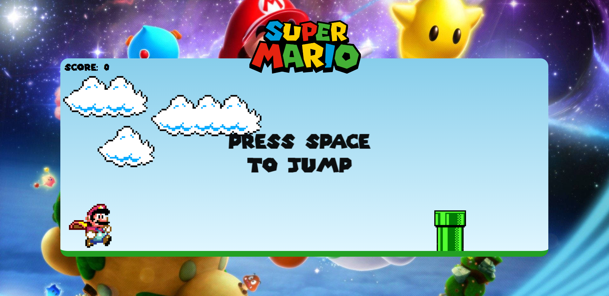
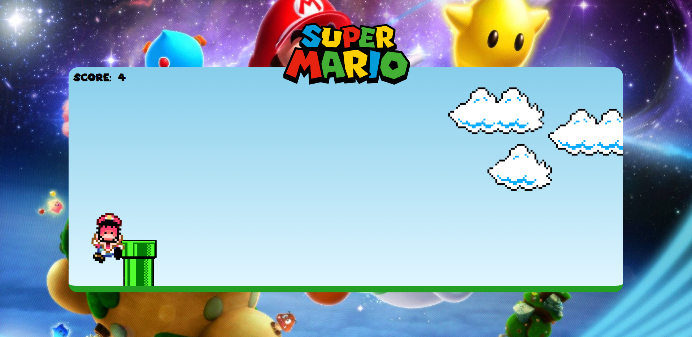
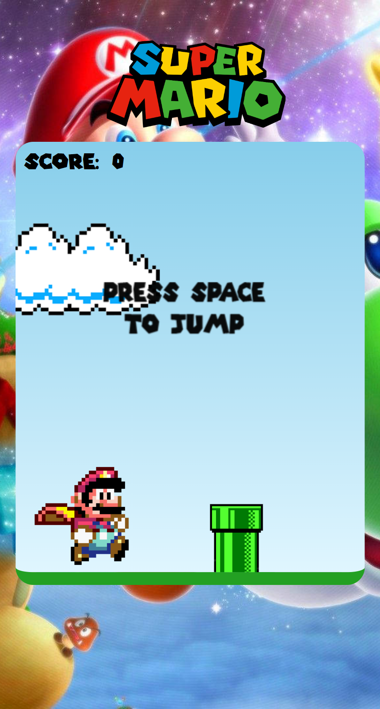

# Super Mario Project

## About

It's a jump game based in Mario Bros 🍄

## Index

-   <a href="#📺-layout">Layout</a>
-   <a href="#🌐-demonstration">Demonstration</a>
-   <a href="#🛠️-technologies-used">Technologies used</a>

## 📺 Layout

## 🌐 Demonstration

[Super Mario Jump](https://supermario-eduvarjaor.netlify.app/)

## 🛠️ Technologies used

1. [HTML](https://developer.mozilla.org/en-US/docs/Web/HTML)
2. [CSS](https://developer.mozilla.org/en-US/docs/Web/CSS)
3. [JavaScript](https://developer.mozilla.org/en-US/docs/Web/JavaScript)

I hope this guide has helped you. Thanks for reading! 😉
